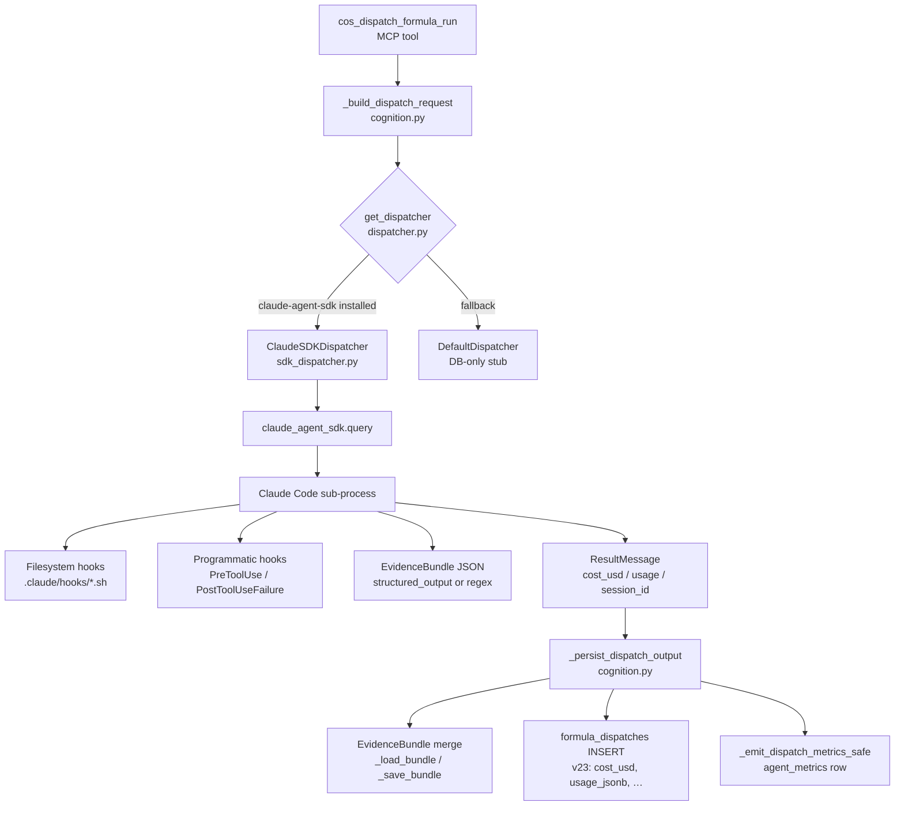

<!-- domain:ADAPTERS | layer:reference | ssot:true | updated:2026-05-05 -->
# Claude Adapter — Architecture (Phase Q.deep)

Dependency graph from MCP tool call down to sub-session result.

## Dependency graph (text)

```
cos_dispatch_formula_run (MCP tool, server.py)
  └─ cognition.py::_build_dispatch_request()
       └─ dispatcher.py::get_dispatcher()          ← factory
            ├─ ClaudeSDKDispatcher (available)     ← adapters/claude/sdk_dispatcher.py
            │    └─ claude_agent_sdk.query()
            │         └─ Claude Code sub-process
            │              ├─ .claude/hooks/*.sh   ← filesystem hooks (core + adapter-private)
            │              ├─ programmatic hooks   ← PreToolUse / PostToolUseFailure closures
            │              ├─ EvidenceBundle JSON  ← structured_output or transcript extraction
            │              └─ ResultMessage        ← total_cost_usd, usage, session_id, subtype
            └─ DefaultDispatcher (fallback)
                 └─ DB-only stub (no sub-process)

After dispatch:
  cognition.py::_persist_dispatch_output()
    ├─ EvidenceBundle merge (_load_bundle / _save_bundle)
    ├─ formula_dispatches INSERT (v23 columns: cost_usd, usage_jsonb, …)
    └─ _emit_dispatch_metrics_safe()  → agent_metrics row
```

## Mermaid diagram



## Key contracts per layer

| Layer | File | Contract |
|---|---|---|
| MCP tool | `core/thinking_os/tools/cognition.py` | Accepts `formula_id`, `session_id`, `task_marker`; returns `ok(…)` / `fail(…)` envelope |
| Dispatch protocol | `core/thinking_os/dispatcher.py` | `DispatchRequest` → `DispatchResult`; adapter-agnostic; no Claude imports |
| Claude adapter | `adapters/claude/sdk_dispatcher.py` | Translates `DispatchRequest` → `ClaudeAgentOptions`; maps SDK subtypes to `status` |
| SDK | `claude_agent_sdk` ≥ 0.1.73 | `query(prompt, options)` yields `AssistantMessage` / `ResultMessage` / `UserMessage` |
| Persistence | `cognition.py::_persist_dispatch_output` | Merges JSON → EvidenceBundle; INSERTs v23 telemetry columns |
| Hooks | `core/hooks/registry.yaml` | SSOT; `adapter_scope:` field limits Claude-only entries |

## Role frontmatter → ClaudeAgentOptions mapping

| Frontmatter key | ClaudeAgentOptions field | Notes |
|---|---|---|
| `structured_output: true` | `output_format={type:json_schema,…}` | `_resolve_output_schema()` looks up Pydantic class |
| `skills: [clean-code]` | `skills=["clean-code"]` | Sub-session doesn't inherit parent skills |
| `long_context: true` | `betas=["context-1m-2025-08-07"]` | Opt-in; only researcher sets this by default |
| `enable_file_checkpointing: true` | `enable_file_checkpointing=True` | implementer + refactorer only |
| `model_pref.complex: opus` | `model="claude-opus-4-7"` | Via `DispatchRequest.model` |
| `timeout_s: 120` | `asyncio.wait_for(timeout=120)` | Wraps the entire `query()` stream |

## Session id flow (T7.1)

```
sub_session_id = f"ses-claude-sdk-{formula}-{ts}-{pid}"
  ↓ passed to ClaudeAgentOptions(session_id=sub_session_id)
  ↓ presence file: .coding-os/claude/sessions/<sub_session_id>.json
  ↓ formula_dispatches.session_id column
  ↓ hub /api/cognition/dispatchers rows
```

## See also

- [claude-deepening-checklist.md](claude-deepening-checklist.md) — work item tracker
- [claude-sdk.md §17a](claude-sdk.md) — D1–D6 architectural decisions
- [docs/engineering/hub-architecture.md](../engineering/hub-architecture.md) — web layer
