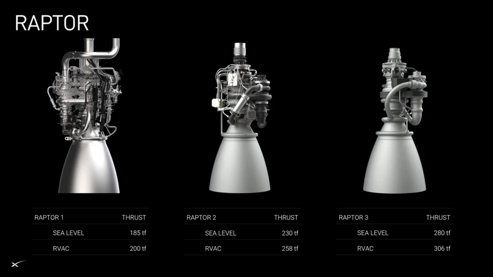

<!-- domain:ALL | layer:architecture | ssot:true | updated:2026-07-16 -->
# Raptor Consolidation Lens — Architecture Review Standard

> **Use when:** designing or reviewing any subsystem, adapter, hook set, or refactor where the question is "is this the simplest structure that does the whole job?" This is the architecture-review companion to [anti-overengineering](../../src/core/rules/anti-overengineering.md) (which governs the *size* of a change; this lens governs the *shape* of the system).

## The metaphor

SpaceX's Raptor engine evolved from a machine wrapped in visible plumbing, sensors, and glue (Raptor 1) to a compact unit where the plumbing is internalized, consolidated, or deleted (Raptor 3) — smaller, cheaper, *and* more powerful. The capability did not shrink; the parasitic structure around it did.

coding-os aims for the same trajectory: every generation of the kernel should carry **more capability per moving part**, never more parts per capability.

## The four principles

### 1. Component consolidation

Merge scattered sibling subsystems into one coherent unit when they share a lifecycle and callers.

- *In practice here:* thinking_os / graph_os / board_os live on **one** MCP server process, not three; the hook registry is **one** yaml rendered per adapter, not per-adapter hand-written configs.
- *Review question:* "Do these two modules ever change independently? If not, why are they two modules?"

### 2. Zero-overhead abstractions

Hide internal complexity behind a minimal interface that costs nothing at run time and nothing in reader attention.

- *In practice here:* the `ok()`/`fail()` envelope (Rule 13) is one contract over ~140 tools; `$COS_*` env vars abstract the agent runtime without a compatibility layer.
- *Review question:* "Does this interface make the caller's code shorter, or does it just relocate the complexity?"

### 3. Elimination of parasitic complexity

Delete glue code, redundant telemetry, duplicated nudges, and pass-through layers that exist only to connect other parts.

- *In practice here:* prose that restates a hook-enforced rule is parasitic (the hook is the enforcement; the prose is duplicate mass). Two nudge hooks with overlapping triggers should merge.
- *Review question:* "If I delete this, what actually breaks — a behavior, or only a feeling of safety?"

### 4. High cohesion and internalized design

Make each unit self-sufficient: fewer external dependencies, behavior owned where the data lives.

- *In practice here:* P8 (never import an adapter SDK from `src/core/**`); hooks source one `cos-env.sh` instead of each resolving paths.
- *Review question:* "Can this unit be tested and reasoned about without loading its neighbors?"

## How to apply in a review

1. Draw the part count before/after: a design that adds parts must name the capability that pays for each one.
2. Prefer deleting a seam over documenting it.
3. A consolidation that raises blast radius (see AGENTS.md § Modularity Map) needs a migration note — consolidation is not an excuse to skip the seam analysis.
4. Cite this doc in the task work log when a design decision is justified by one of the four principles.

## See also

- [constitution.md](../governance/constitution.md) — value 4 (smallest-correct-change) is the per-change form of this lens.
- [vision.md](../governance/vision.md) — why the product must stay Raptor-3-shaped as it grows.
- [anti-overengineering](../../src/core/rules/anti-overengineering.md) — the always-active rule this lens extends to architecture scale.
