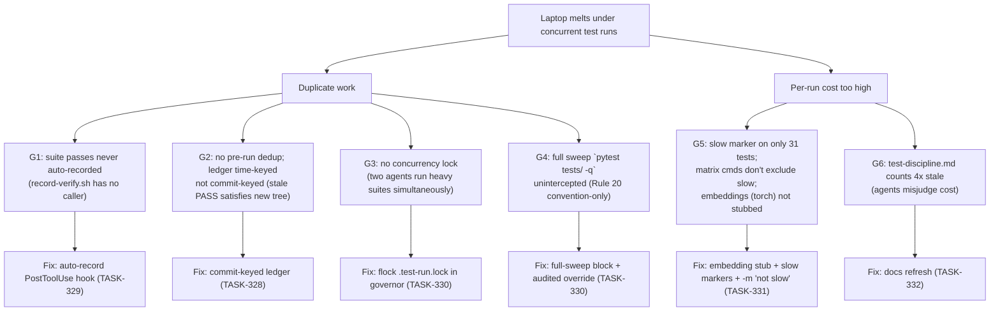
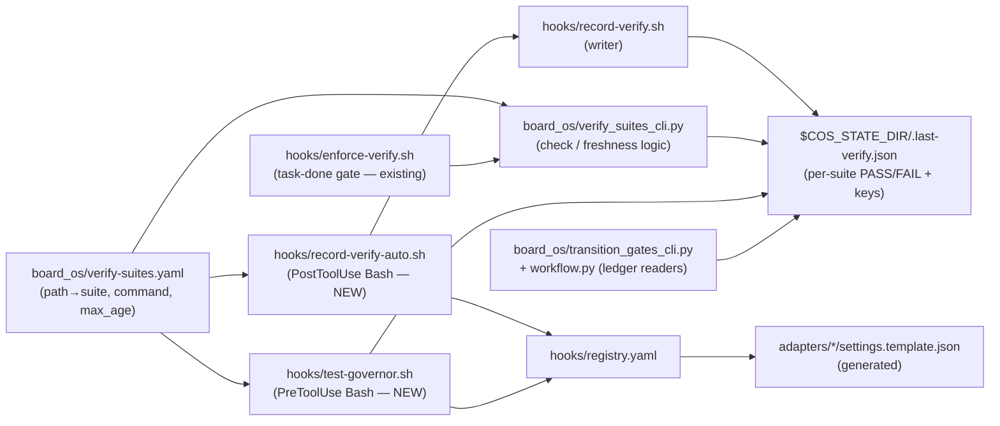

# Test Governance — Multi-Agent-Safe, Laptop-Safe Suite Execution

> SSOT for the verify-ledger schema, the auto-record + test-governor hooks, and the
> suite-hygiene contract. Tasks: TASK-327 (baseline) · TASK-328 (ledger) · TASK-329
> (auto-record) · TASK-330 (governor) · TASK-331 (hygiene) · TASK-332 (docs) ·
> TASK-333 (xdist spike, deferred).

## Problem

Multiple concurrent agent sessions each finish a task and re-run heavy pytest suites.
The suite is 4,110 tests / 289 files; `tests/` alone holds 1,316 integration-heavy tests
(36 files scaffold `cos init`/`install.sh` sandboxes, 40 spawn subprocesses, 23 spawn
nested `uv run`). thinking_os tests import torch via `embeddings.py` (~2 GB RSS per
pytest process; only 7/56 files mock embeddings). Two concurrent full runs swap an
M3 Pro into UI freeze. Rule 20 (no full sweeps mid-task) is convention-only — nothing
intercepts `pytest tests/ -q`, nothing dedups a suite another agent turned green
minutes earlier, and nothing serializes concurrent runs.

## Problem tree



## Artifact dependency graph



Ledger readers that must survive the schema change: `verify_suites_cli._check_suites`,
`transition_gates_cli.py:77` (`.last-verify.json` most-recent-suite read),
`board_os/workflow.py:443` (DoD freshness signal). The `enforce-verify.sh → python -m
core.board_os.verify_suites_cli` call crosses the shell/python boundary and is invisible
to the graph — treat the hook as a first-class caller of `cmd_check` in any refactor.

## Ledger schema v2 (TASK-328)

`$COS_STATE_DIR/.last-verify.json` — one object per suite name:

```json
{
  "test-thinking_os": {
    "status": "PASS",
    "ts": 1781060000,
    "git_head": "<40-char sha of HEAD when the suite ran>",
    "dirty_digest": "<sha1 over `git diff HEAD` + sorted untracked paths; 'clean' when none>",
    "agent": "claude",
    "session_tail": "211-ff21"
  }
}
```

Freshness rule (replaces time-only): a PASS is **fresh** iff
`status == "PASS"` **and** `age <= max_age_seconds` **and** `git_head == current HEAD`
**and** `dirty_digest == current digest`. Entries missing `git_head`/`dirty_digest`
(v1 records) are always stale — backward compatible, no migration needed.
Writers: `record-verify.sh` (gains the four fields; JSON write serialized via Python
`fcntl.flock` inside the writer helper — works on macOS, unlike the absent `flock(1)`
binary). Readers keep degrading gracefully: a v2-unaware reader sees the same
`status`/`ts` keys. `git_head`/`dirty_digest` come from one source —
`verify_suites_cli tree-state` (new subcommand) — so bash and Python can never drift.

## Hook contracts

### record-verify-auto (PostToolUse Bash — TASK-329, observation phase, fail-open)

- Parses tool result payload; matches the completed command against the `command`
  strings in merged verify-suites config (data-driven; no hardcoded paths).
- On match: `record-verify.sh <suite> <PASS|FAIL>` (exit-code-derived) with v2 fields.
- Always `exit 0`; malformed input, missing config, missing git → silent no-op
  (debug line to hook log only).

### test-governor (PreToolUse Bash — TASK-330, gate phase)

Fires only when the Bash command is a pytest / make-verify invocation. Decision order:

1. **Full sweep?** (bare `pytest tests/`, pytest with no path, or ≥3 testpaths) →
   BLOCK (`exit 2`) unless `COS_FULL_SWEEP_OK=1` and `COS_OVERRIDE_REASON` ≥ 15 chars
   (mirrors `COS_VERIFY_OVERRIDE`); override is logged. Promotes Rule 20 to enforcement.
2. **Dedup:** resolve the suite (same data-driven match); ledger shows fresh v2 PASS
   for the current tree → BLOCK with `"<suite> green <N>min ago by <agent> — reuse,
   or COS_TEST_FORCE=1 to re-run"`.
3. **Lock:** `$COS_STATE_DIR/.test-run.lock` is a JSON lockfile
   `{suite, agent, session_tail, started_ts}` — NOT an `flock(1)` lock: the binary
   does not exist on stock macOS, and a PreToolUse hook exits before pytest starts so
   it could not hold an advisory lock across the run anyway. The governor treats the
   lock as **held** iff it exists AND `now - started_ts < lock_ttl` (default 1800 s)
   AND a live `pytest` process is visible (`pgrep -f pytest`). Held → BLOCK naming the
   holder; stale (TTL exceeded or no live pytest) → overwrite and proceed. The
   auto-record PostToolUse hook removes the lockfile when the suite command completes;
   a crashed agent's lock self-expires via the TTL/liveness check.
4. Otherwise allow; block messages recommend `nice -n 19` (macOS alt: `taskpolicy -b`).
- Internal errors → fail-open (`exit 0`); the sweep check is the only fail-closed leg.

### Persona × scenario coverage

| Persona | Governor fires? | Ledger benefit |
|---|---|---|
| Claude Code solo | ✅ PreToolUse Bash | dedup + lock + sweep gate |
| 2 Claude panels, same repo | ✅ each panel | shared `$COS_STATE_DIR` ledger + lock serialize them |
| Claude + Codex CLI | ✅ (Codex has Bash matchers) | same |
| Codex GUI (0 hooks) | ❌ | its runs still auto-record? No (no hooks) — but it READS nothing; other agents' ledger entries unaffected; its runs simply unrecorded |
| Human pytest | ❌ | `make` targets call record-verify.sh; documented path |
| CI | ❌ state dir absent | hooks fail-open; CI always runs everything |

Edge scenarios: lock-holder crash → lockfile self-expires via TTL + pytest-liveness check (verified by test);
new commit lands → `git_head` mismatch invalidates all prior PASSes; dirty-tree edit →
`dirty_digest` mismatch invalidates; two agents, different suites → different ledger
keys, lock still serializes the heavy runs intentionally (one suite at a time per host).

## Suite hygiene (TASK-331)

- Autouse fixture in `src/core/thinking_os/tests/conftest.py` stubs `embed_text` /
  model loading; `COS_TEST_REAL_EMBEDDINGS=1` restores the real path (the 7 existing
  per-file mocks unify onto it).
- Slow markers: every test that scaffolds `cos init`/`install.sh` or spawns `uv run`
  gets `@pytest.mark.slow`; matrix commands gain `-m "not slow"`; `make test-slow`
  runs the slow set (pre-merge / CI).
- `pytest-xdist` deliberately NOT adopted locally (raises peak load) — TASK-333 spike
  evaluates CI-only.

## Env vars introduced

| Var | Consumer | Meaning |
|---|---|---|
| `COS_TEST_FORCE=1` | test-governor | re-run a suite the ledger says is fresh |
| `COS_FULL_SWEEP_OK=1` + `COS_OVERRIDE_REASON` | test-governor | audited full-sweep override |
| `COS_TEST_REAL_EMBEDDINGS=1` | thinking_os conftest | bypass embedding stub |

## Baseline (TASK-327 — measured 2026-06-09)

> Acceptance for TASK-331 is ≥30% wall-clock cut on test-thinking_os vs this table.
> Hardware: MacBook M3 Pro, runs serialized under `nice -n 19`.

| Suite | Tests collected | Wall-clock | Peak RSS | Top offender (durations) |
|---|---|---|---|---|
| test-thinking_os | 1,446 | **322 s** (5:22) | ~700 MB (parent) | `test_background.py` — 6 tests = **237 s (74%)**; worst single: `test_status_is_json_safe` 113 s |
| test-graph_os | 1,191 (12 skip) | 23 s | – | all <0.2 s — healthy |
| test-board_os | 453 | 27 s | – | all <0.7 s — healthy |
| test-cli | 52 | **762 s** (12:41) | – | every `TestInit` test ≈ 28–30 s (full `cos init` scaffold per test); 1 pre-existing FAIL: `test_idempotent_init` (assert 3 == 0) |
| test-adapters | 48 | 153 s | – | 3 tests ≈ 35–40 s (init+link scaffolds) |
| test-template-scaffold | 40 | **418 s** (6:58) | – | fixtures 47–61 s each (template scaffolds) |

Sum of matrix suites ≈ **28.4 min** — the "6-minute full sweep" figure in
test-discipline.md predates the suite's 4× growth. `tests/` root collects 2,551
(+2 pre-existing collection errors: `test_intent_classifier.py`,
`test_route_audits.py` — ImportError under the default extras). The dominant
costs are (a) `test_background.py` polling loops in thinking_os, (b) per-test
`cos init` scaffolds in test-cli / test-template-scaffold / test-adapters —
(a) addressed by the slow split below; (b) governed by the dedup/lock layer,
scaffold session-scoping deferred.

## Post-hygiene results (TASK-331 — measured 2026-06-10)

| Metric | Baseline | After | Δ |
|---|---|---|---|
| test-thinking_os wall-clock | 322 s | **61 s** (1,427 passed, 27 deselected) | **−81%** |
| test-thinking_os peak RSS | ~700 MB | ~487 MB | −30% |

Mechanism: `test_background.py` module-marked `slow` (runs via `make test-slow`,
314 tests across thinking_os + tests/); autouse conftest stub replaces
SentenceTransformer with a deterministic token-hash encoder (4 true-semantic
tests carry `@pytest.mark.real_embeddings` and keep the real model;
`COS_TEST_REAL_EMBEDDINGS=1` restores it everywhere).

Dogfood catches during rollout (fixed + regression-tested): (1) a quoted suite
string inside a heredoc was auto-recorded as a PASS — matching is now
segment-anchored (`_pytest_segments`); (2) inline `COS_*=1` prefixes live in
the command string, not the hook's env — the governor honors both forms;
(3) commands that merely *mention* pytest no longer write or clear the run lock
(`pytest_invocation` field).

## See also

- [src/core/board_os/verify-suites.yaml](../../src/core/board_os/verify-suites.yaml)
- [src/core/rules/test-discipline.md](../../src/core/rules/test-discipline.md)
- [src/core/rules/git-workflow.md](../../src/core/rules/git-workflow.md) — concurrency table
- [docs/governance/critical-rules.md](../governance/critical-rules.md) — Rules 20/22/25
