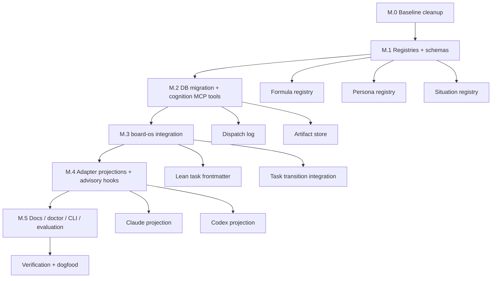

<!-- domain:THINKING_OS | layer:plan | ssot:true | updated:2026-04-24 -->
# Hybrid `thinking-os` v0.3 — Formula Orchestration + Persona Routing

Purpose: Phase M plan — formula (F1..F11) orchestration + persona routing for the thinking-os supervisor.
Read when: touching `core/thinking_os/{cognition,formula_composer,dispatcher}.py`, Phase M role files, or agent dispatch.
Skip when: unrelated to role/persona/formula routing.

## Context

`coding-os` is a meta-project whose cognitive heart is the `thinking-os` MCP server, the board-os task system, and the graph/doc retrieval layers around them. A new proposal in [docs/code-os-core-docs/thinkingos-formulas/formulas-en.md](docs/code-os-core-docs/thinkingos-formulas/formulas-en.md) introduces 11 lifecycle formulas (F1 Research → F11 Refactoring), a 7-criteria Anti-Ambiguity gate, a Navigation Protocol (Zoom/Backtrack/Discovery/Anti-Paralysis), a Traceability Check, Intensity Levels (Light/Standard/Full), and role-based personas.

**Reframed user intent:** make the 11 formulas dispatchable and auditable as a small cognition control-plane on top of the existing Cognitive Cycle. Phase M must not replace thinking-os, must not fork task storage away from board-os, must not invent adapter-specific truths, and must stay honest about Claude vs Codex runtime differences.

### Two orthogonal axes

```
                Personas (WHO thinks — routing profiles)
                            │
                            ▼
                ┌───────────────────────┐
   Supervisor → │  picks N formulas to  │
                │  dispatch per task    │
                └─────────┬─────────────┘
                          │ dispatches
                          ▼
       Formula-agents (WHAT to think — 11 specialised subagents)
       F1-Research · F2-Decompose · F3-Architect · F4-Document · F5-Implement
       F6-Test/Review · F7-Debug · F8-Security · F9-Deploy · F10-Monitor · F11-Refactor
```

### Validated gaps in current thinking-os (8 unconsidered cases)

| # | Gap | Where formulas-en proposes it | Today |
|---|---|---|---|
| 1 | No shared **cognition SSOT** for formulas / personas / situations across adapters | whole proposal | absent |
| 2 | No durable **resume / audit state** for multi-step cognition | Navigation + Traceability | absent |
| 3 | No explicit **Research phase** before implementation on unfamiliar codebases | F1 | ad-hoc |
| 4 | No **persona-aware cognitive routing** — `cos_route_skill` selects domain skill, not reasoning profile | Role-Based Entry Points | partial |
| 5 | No **Traceability Check** (top↔bottom audit) anchored to tasks + graph + docs | Traceability section | absent |
| 6 | No first-class **backtrack / discovery capture** with deterministic replay | Navigation §4–§5 | ad-hoc |
| 7 | No **Intensity** default aligned with project config + task frontmatter | Usage Map | absent |
| 8 | A naive implementation would create **split-brain** with board-os and Codex capability gaps | not addressed in formulas-en | high risk |

### Normalization checklist (coverage guard)

- One shared source of truth in `core/` for formulas, personas, and situations.
- `board-os` remains the preferred task substrate; Phase M does not revive a legacy-only task path.
- Durable cognition state must be resumable from the DB alone; any on-disk bundle is cache only.
- `CLEAR 1` stays fast; heavy cognition orchestration activates only for `COMPLICATED` / `COMPLEX` or explicit overrides.
- Persona is a routing profile, not a permanent role-play prison.
- Existing skills stay orthogonal to formulas; F5/F6 use them as domain guides.
- No new correctness guarantee may depend solely on Codex Write/Edit hooks.
- Doctor numbering, schema versions, and tool counts must use the next free slot and must not hardcode stale counts.

### Dependency graph (implementation order)



---

## Design — Cognition Registry + Supervisor + Persona Routing

### Principle

- **Cognitive Cycle** (CLASSIFY→MAP→ORIENT→PLAN→EXECUTE) stays as the outer loop. Phase M adds a deterministic supervisor inside that loop; it does not replace the loop.
- **Formulas / personas / situations** live in shared core registries. Adapters project them into Claude- and Codex-specific execution surfaces; they are not the canonical source.
- **board-os** is the preferred task substrate. Task metadata for `persona:`, `intensity:`, and `situation:` lands first in lean frontmatter and the board cache, then cognition reads from there.
- **Durable cognition state** is DB-backed and append-only. Optional per-session JSON snapshots are caches for fast local resume, not the source of truth.
- **Existing 8 skills** (clean-code, codebase-explorer, etc.) remain domain implementation guides invoked during F5/F6. No collision: skills = HOW to write code in a stack; formulas = WHICH cognitive step is happening now.

### Phase × Formula attach table (canonical)

This is the table the supervisor consults when a persona's `primary_formulas` set is filtered by current cycle phase.

| Cycle phase | Mandatory formulas | Optional formulas | Default invokers (personas) |
|---|---|---|---|
| CLASSIFY | (Complexity Gate only) | F1 if codebase unfamiliar | all |
| MAP | F1 (Research), F2 steps 1–6 | F2 7–12 | tech-lead, backend, architect |
| ORIENT | F2 steps 7–12 (data/state/events/perms/deps/unknowns) | F11 debt scan | architect, legacy-maintainer |
| PLAN | F3 (Architecture), F2 step 12 (recursive checklist) | F8 pre-design | architect, tech-lead, solo-builder |
| EXECUTE | F5 (Implementation), F4 (docs-as-you-go) | F11 scout cleanup | backend, frontend, solo-builder, mobile, ai-ml |
| post-EXECUTE | F6 (Test/Review/Perf), F8 (Security), F7 (if bug) | F9 deploy, F10 monitor | qa, devops, security-reviewer |
| periodic | F11 (Refactor), F8 audit, Traceability sweep | — | architect, legacy-maintainer, security-reviewer |

The supervisor's `next_action` is always: take persona's `primary_formulas` ∩ current phase's "Mandatory" column ∩ not-yet-dispatched. If empty, advance phase.

### Formula registry format (canonical)

Canonical sources live in `core/thinking_os/formulas/registry.yaml` plus prompt fragments under `core/thinking_os/formulas/F<N>_<name>.md`. Adapter-specific runtime surfaces are generated from this registry; the registry, not the adapter path, is the SSOT.

```markdown
---
id: F2
name: "Problem Decomposition & Analysis"
formula_ref: F2
attach_phases: [MAP, ORIENT, PLAN]
intensity_min: light                   # included in Light intensity
backtrack_targets: [F1]                # may signal "need more research"
model_pref:
  complicated: sonnet
  complex: opus
tools_budget:                          # MCP tools the agent may call
  - cos_search
  - cos_doc_search
  - cos_graph_query
  - cos_graph_context
  - Grep
  - Glob
  - Read
input_schema: cognition.F2Input        # references Pydantic class
output_schema: cognition.F2Output
max_tokens_in: 8000                    # input cap for token-budget rollup
max_tokens_out: 4000
timeout_s: 90
intensity_steps:                       # which sub-steps run per intensity
  light:    [1, 2, 3, 4, 5]            # F2 1-5 only in Light (per formulas-en.md)
  standard: [1, 2, 3, 4, 5, 6, 7, 8, 9, 10, 11, 12]
  full:     [1, 2, 3, 4, 5, 6, 7, 8, 9, 10, 11, 12]
backtrack_triggers:                    # deterministic re-dispatch signals
  - signal: missing_actor              # surfaced by F3 / F5 / F6
    target: F2
    reason_template: "Actor referenced but not in F2 actor map: {actor}"
  - signal: undefined_capability
    target: F2
    reason_template: "Capability {cap} not in F2 goal tree"
criteria_required:                     # 7-criteria gate per step
  step_1: [scoped, measurable, owned, connected_to_user_value]
  step_2: [observable, scoped, owned]
  step_3: [scoped, testable, observable]
  step_4: [testable, observable, scoped]
  step_5: [testable, scoped]
  step_6: [scoped, observable]
  step_7: [observable, testable]
  step_8: [observable, scoped]
  step_9: [scoped, owned, reversible_or_justified]
  step_10: [scoped, observable]
  step_11: [observable, owned]
  step_12: [testable, scoped, owned, observable]
---

# F2 — Problem Decomposition & Analysis

## Your role
You are the F2 cognitive agent. Your job is to decompose a problem from
zero to leaf-tasks where each is implementable in 1–2 days. You produce a
structured `F2Output` (problem statement, actor map, goal tree, scenarios,
decision table, conceptual data model, state machines, event map,
permission matrix, dependency map, unknowns).

## Inputs you receive
{{ F2Input rendered }}

## Procedure
[12 steps verbatim from formulas-en.md §Formula 2]

## Output contract
Return JSON matching F2Output. No prose outside the JSON.
```

The formula source is projected into runtime surfaces:
- **Core SSOT:** `registry.yaml` + prompt fragment define metadata, prompt body, IO contract, and tool restrictions.
- **Claude projection:** materialize to a project-scoped formula subagent surface (or render directly into `Task`) from the registry.
- **Codex projection:** materialize to `.codex/commands/formula-f2.md` for sequential command-based execution.

The projection layer is a UX surface, not a second truth.

### Persona file format

Stored at `core/thinking_os/personas/<id>.yaml`. **No prompt body** — personas are routing profiles. They may inject a prompt prefix into formulas they dispatch, but they do not own separate prompt logic. The `scenarios:` block is a cold-start routing hint, not a second workflow engine.

```yaml
id: backend
label: "Backend Engineer"
primary_formulas: [F3, F5, F6, F7]      # MUST dispatch
secondary_formulas: [F2, F8]            # MAY dispatch (intensity-gated)
reasoning_style: "system-thinker"        # injected as prompt prefix
intensity_default: standard
triggers:
  domains: [backend, api, database]
  task_types: [feature, refactor, debug]
  complexity_min: COMPLICATED
model_pref:
  complicated: sonnet
  complex: opus
prompt_prefix: |
  Reason as a production backend engineer with strong emphasis on
  experience. Prioritise correctness, observability, and reversibility.
scenarios:                              # canonical paths (PRISM cold-start)
  - id: schema-migration-rollout
    formula_path: [F2, F3, F5, F6]
    score_hint: 9
  - id: external-api-integration
    formula_path: [F2, F3, F8, F5, F6]
    score_hint: 8
```

**Core persona roster — v1.** The kernel ships only generic, enterprise-safe personas. Domain-specific personas and benchmark simulations remain in fixtures / templates until those stacks ship as first-class overlays.

| Persona id | Source | Initial state | Notes |
|---|---|---|---|
| architect | formulas role table | enabled | F1, F2, F3, F4 primary |
| tech-lead | formulas role table | enabled | design-review + architecture arbitration |
| backend | formulas role table | enabled | F3, F5, F6, F7 primary |
| frontend | formulas role table | enabled | F5, F6, F7 primary |
| qa | formulas role table | enabled | F2 scenarios + F6 ownership |
| devops | formulas role table | enabled | F9, F10, infra side of F8 |
| security-reviewer | Phase M generic | enabled | F8 primary, F6 secondary |
| legacy-maintainer | formulas role table | enabled | takeover + F7/F11 heavy |
| solo-builder | formulas role table | enabled | all formulas, intensity-gated |
| student | formulas role table | enabled | light defaults, guided path |
| mobile | domain extension | `disabled: true` | template-owned once mobile stack lands |
| ai-ml | domain extension | `disabled: true` | template-owned once AI/ML stack lands |

### Supervisor — the dispatch brain

Lives in `core/thinking_os/cognition.py` as a pure-Python state machine; exposed via the MCP tool `cos_supervise`. The main agent calls `cos_supervise` after the Complexity Gate and task context are recorded; it returns the **next action** plus rationale, required inputs, and the projection target for the current adapter. The supervisor never spawns agents, never edits files, and never becomes the source of truth for task state. It is a deterministic control-plane.

```
┌────────────────────────────────────────────────────────────────┐
│ Supervisor state machine (deterministic, in cognition.py)      │
│                                                                │
│ states: IDLE → CLASSIFYING → ROUTING → DISPATCHING →           │
│         AWAITING_AGENT → INTEGRATING → DONE                    │
│         (BACKTRACKING is a transition, not a state)            │
└────────────────────────────────────────────────────────────────┘

cos_supervise(session_state) → NextAction:
  match session_state.phase:
    IDLE         → return {action: "classify", prompt: "run Complexity Gate"}
    CLASSIFYING  → wait for gate + active task context
    ROUTING      → resolve situation override → resolve persona → load
                   formula registry → return {action: "dispatch",
                   formula: first_unmet, why: "..."}
    DISPATCHING  → return {action: "dispatch", formula: next_in_chain,
                            input: build_evidence_bundle(prior_artifacts),
                            projection: "formula-f<N>"}
    AWAITING_AGENT → wait for cos_supervise_record_output(formula, output)
    INTEGRATING  → validate output against schema + persist artifact row
                   → if missing prereq: return {action: "backtrack", to: F_prev,
                                                reason: ...}
                   → else: advance to next formula or DONE
    DONE         → run traceability + ambiguity gates; return {action: "done"}
```

### Inter-agent handoff — `EvidenceBundle`

Every formula-agent produces a typed output that becomes part of an immutable `EvidenceBundle` carried forward. `EvidenceBundle` is the assembled in-memory view presented to the supervisor and the next formula. The durable source of truth is append-only DB rows (`formula_dispatches` + `formula_artifacts`); any on-disk JSON bundle is a cache/snapshot only and can be regenerated from the DB.

Defined as Pydantic models in `core/thinking_os/cognition_schemas.py`:

```python
class EvidenceBundle(BaseModel):
    task_marker: str
    persona_id: str
    intensity: Literal["light", "standard", "full"]
    F1_research: F1Output | None = None
    F2_decompose: F2Output | None = None
    F3_architect: F3Output | None = None
    # ... through F11
    backtracks: list[BacktrackEvent] = []
    discoveries: list[Discovery] = []

class F2Output(BaseModel):
    problem_statement: str
    scope_in: list[str]
    scope_out: list[str]
    success_metrics: list[Metric]
    actors: list[Actor]
    goal_tree: GoalNode
    scenarios: list[Scenario]
    decision_table: DecisionTable
    data_model: ConceptualModel
    state_machines: list[StateMachine]
    events: list[EventDef]
    permissions: PermissionMatrix
    dependencies: DependencyGraph
    unknowns: list[Unknown]
```

Optional snapshot path: `.coding-os/<agent>/evidence_bundle.json`. The snapshot is regenerated after successful artifact writes and may be discarded / rebuilt at any time. Agents still receive only the slices they need (for example F3 reads F1+F2 outputs but not future formulas).

### Persona resolver (deterministic, cached)

`cos_route_persona(domain, task_type, complexity, dimensions)`:
1. If task frontmatter or explicit call requested a valid persona override, use it.
2. Cache hit on `.coding-os/<agent>/.persona` for the same `task_marker` → return.
3. Score generic personas by trigger overlap + warm history (`persona_selections` ⨝ `task_outcomes`); cold-start uses static triggers only.
4. Apply static compatibility rules / explicit denylist from the registry. Learned negative pairs are a future phase, not a launch dependency here.
5. Persist to `.persona` cache + `persona_selections` table.
6. Return `{persona_id, confidence, primary_formulas, secondary_formulas, intensity, prompt_prefix, model_pref}` via `ok()`.

### Anti-Ambiguity gate (cheap, phase-boundary only)

Fires at PLAN→EXECUTE and before task transitions into `testing` / `complete`, not per edit. The supervisor calls `cos_ambiguity_check(bundle)` which walks each formula's `criteria_required` and verifies the bundle satisfies them. Missing criteria → `fail("validation", "F2.1 missing criterion: scoped")`.

Primary enforcement lives in `cos_supervise` and the board-os transition path. Claude may get an advisory hook later, but Phase M correctness does **not** depend on a Write/Edit gate. `CLEAR 1` bypasses; `intensity=full` allows zero skips.

**The 7 canonical criteria** (formulas-en.md §Anti-Ambiguity Criteria) are typed in `cognition_schemas.py`:

```python
class AmbiguityCriterion(StrEnum):
    OBSERVABLE              = "observable"               # behavior visible
    MEASURABLE              = "measurable"               # number assignable
    TESTABLE                = "testable"                 # Given/When/Then writable
    SCOPED                  = "scoped"                   # boundary defined + finite
    OWNED                   = "owned"                    # responsible party named
    REVERSIBLE_OR_JUSTIFIED = "reversible_or_justified"  # undoable OR strong reason
    CONNECTED_TO_USER_VALUE = "connected_to_user_value"  # solves a user pain
```

Each formula's per-step `criteria_required` (see Agent file format above) declares which subset must be present in that step's output before the bundle is considered ambiguity-clean.

### Failure modes (explicit policy)

These are the four production failure modes the supervisor must handle. Each has a deterministic policy — no "TODO" or implicit assumption.

| Failure | Detection | Policy |
|---|---|---|
| **Formula-agent timeout** (>`timeout_s` from agent file) | Main agent reports timeout to `cos_supervise_record_output(status="timeout")` | Mark dispatch `status=timeout` in `formula_dispatches`; standard/light may continue with a degraded marker, `intensity=full` blocks pending explicit retry / override. |
| **Corrupted bundle snapshot JSON** | Supervisor catches `json.JSONDecodeError` on snapshot read | Quarantine to `evidence_bundle.corrupt-<ts>.json`; emit one warning to `.hooks.log`; rebuild the snapshot from `formula_artifacts` rows. Never treat the snapshot as the only copy. |
| **Concurrent sessions on same repo** | Multiple sessions write cognition artifacts at once | DB rows stay isolated by `session_id` + `task_marker`; optional snapshot files are session-scoped. No shared file lock is required for correctness. |
| **Session interrupted mid-dispatch** (process killed, agent crashed) | `cos_supervise` reads open dispatch rows on next call | Resume from `formula_dispatches WHERE session_id=? AND status IN ('planned','dispatched') ORDER BY ts DESC LIMIT 1`. If an artifact already exists for the same `(session_id, formula_id, input_hash)`, reuse it; otherwise re-issue idempotently. |

Snapshot TTL: 24h. `session_startup.py` may prune stale `evidence_bundle*.json` snapshots on startup, but it does not delete durable DB artifacts.

Persona evolution: persona is **locked per `task_marker`**. A Reframe Trigger (per existing thinking-os rule: problem redefined / actor missing / boundary changed / constraint changed) creates a new `task_marker` via the task-start / board transition flow, which triggers a fresh persona resolution. No mid-task persona swaps — they're a code smell for incoherent classification.

### Backtrack + Anti-Paralysis

`cos_backtrack_log(from_formula, to_formula, reason)` writes to `backtrack_events`. When supervisor returns `{action: "backtrack", ...}` it auto-calls this. Counter ≥3/session → non-blocking warning (Anti-Paralysis Guard). Counter ≥5 → stronger advisory. Never blocks (preserves agent autonomy).

### Discovery Protocol

`cos_discovery(kind, summary, impact_assessment, decision)` where `decision ∈ {backtrack_now, record_for_later}`. Backtrack-now decisions auto-call `cos_backtrack_log`. Stored as `observations` rows with `kind='discovery'` (no new table). On session end, `session_summary.py` lists unaddressed `record_for_later` discoveries in the summary — agents can elect to promote them to tasks via `cos_task_create`.

### Situational Paths (registry-driven dispatch)

formulas-en.md §Situational Paths defines 5 dispatch chains that do NOT follow the standard "persona → primary_formulas" flow. These are orthogonal entry points. Stored at `core/thinking_os/situations/registry.yaml`:

```yaml
situations:
  - id: incident-response
    trigger_signals: [production_down, pager_fired, severity_s0, severity_s1]
    precondition: "service must be restored before root-cause work begins"
    dispatch_chain:
      - action: mitigate               # rollback / feature-flag / scale-up
      - action: communicate            # notify stakeholders
      - dispatch: F7                   # debug
      - dispatch: F6                   # regression testing
      - action: post_mortem            # structured writeup via F4
      - dispatch: F10                  # update monitoring so next time catches earlier
    persona_overlay: devops

  - id: onboarding
    trigger_signals: [new_team_member, first_time_contributor]
    dispatch_chain:
      - action: read_f4_outputs        # existing docs
      - action: read_f3_adrs
      - dispatch: F5                   # small scoped implementation task
      - dispatch: F6                   # reviewer role
      - dispatch: F2                   # graduate to analysis
    persona_overlay: student

  - id: scope-change
    trigger_signals: [requirements_changed, client_pivot]
    dispatch_chain:
      - dispatch: F2                   # step 1 only — re-evaluate scope boundary
      - action: traceability_check
      - dispatch: F2                   # affected scenarios / decision tables
      - dispatch: F3                   # if architecture affected
      - dispatch: F4                   # update docs
    persona_overlay: tech-lead

  - id: external-integration
    trigger_signals: [new_third_party_api, payment_gateway, auth_provider]
    dispatch_chain:
      - dispatch: F1                   # mini research — pricing, SDKs, limits
      - dispatch: F2                   # integration-specific scenarios
      - dispatch: F3                   # API contract + circuit breaker
      - dispatch: F5
      - dispatch: F6
      - dispatch: F8                   # security implications of new dependency
    persona_overlay: backend

  - id: design-review
    trigger_signals: [pre_implementation_review_requested]
    precondition: "F3 and F4 must have produced outputs for this task"
    dispatch_chain:
      - action: verify_f2_scenarios_satisfied
      - action: verify_adr_tradeoffs_documented
      - action: approval_gate          # blocks F5 until approved
    persona_overlay: tech-lead

  - id: existing-project-takeover          # formulas-en.md §Existing Project Takeover
    trigger_signals: [legacy_codebase, inherited_repo, no_docs]
    dispatch_chain:
      - dispatch: F2                   # reverse-engineer problem definition, actors, data model
        mode: reverse
      - dispatch: F6                   # characterization tests before changing anything
        mode: stabilize
      - dispatch: F4                   # document what was discovered
      - dispatch: F5                   # then enter standard dev loop
      - dispatch: F6
      - dispatch: F11                  # prioritize technical debt
      - dispatch: F3                   # evaluate architecture evolution
    persona_overlay: legacy-maintainer
```

Supervisor logic: before consulting persona, check `.coding-os/<agent>/.situation` marker (set by the board-aware task-start flow from task frontmatter `situation:` field, or by `cos_situation_detect(signals)` MCP tool). If set, the situation's `dispatch_chain` overrides the persona's `primary_formulas`.

### Traceability Check

`cos_traceability(scope='task'|'project')` — read-only sweep over the board-os task cache (`tasks` + status history), `cos_graph_contracts`, and recent commits. Reports gaps (tasks without doc anchor, endpoints without tests, cognition artifacts with no downstream verification) and possibly-redundant items. Idempotent. Schedulable, never blocking.

### Intensity Levels

- Project-level: `cognition.intensity_default: light|standard|full` in `.coding-os.yaml`.
- Per-task override: optional `intensity:` frontmatter in lean task `.md` files parsed by `core/board_os/parser.py`. `core/thinking_os/task_parser.py` may read the field only for legacy fallback compatibility.
- Resolution: per-task > project > persona default > `standard`.
- `intensity=light` ⇒ supervisor only dispatches `intensity_min=light` formulas (F2, F5, F6 minimum).
- `intensity=full` ⇒ all `primary_formulas` plus all `secondary_formulas`; ambiguity gate refuses any skip.

### DB migration v14 (append-only, 5 small tables)

```sql
CREATE TABLE backtrack_events (
  id INTEGER PRIMARY KEY,
  session_id TEXT NOT NULL,
  from_formula TEXT NOT NULL,
  to_formula TEXT NOT NULL,
  reason TEXT NOT NULL,
  ts TEXT NOT NULL DEFAULT (datetime('now'))
);
CREATE INDEX idx_backtrack_session ON backtrack_events(session_id, ts);

CREATE TABLE persona_selections (
  id INTEGER PRIMARY KEY,
  session_id TEXT NOT NULL,
  task_marker TEXT,
  persona_id TEXT NOT NULL,
  confidence REAL NOT NULL,
  reason TEXT,
  intensity TEXT NOT NULL,
  ts TEXT NOT NULL DEFAULT (datetime('now'))
);
CREATE INDEX idx_persona_session ON persona_selections(session_id);

CREATE TABLE ambiguity_violations (
  id INTEGER PRIMARY KEY,
  session_id TEXT NOT NULL,
  formula_id TEXT NOT NULL,
  step_id TEXT,
  criterion TEXT NOT NULL,
  detail TEXT,
  ts TEXT NOT NULL DEFAULT (datetime('now'))
);
CREATE INDEX idx_ambiguity_session ON ambiguity_violations(session_id);

CREATE TABLE formula_dispatches (
  id INTEGER PRIMARY KEY,
  session_id TEXT NOT NULL,
  task_marker TEXT,
  persona_id TEXT NOT NULL,
  formula_id TEXT NOT NULL,
  input_hash TEXT NOT NULL,        -- sha256 of input slice
  output_hash TEXT,
  latency_ms INTEGER,
  status TEXT NOT NULL,             -- planned|dispatched|ok|fail|timeout|backtrack
  ts TEXT NOT NULL DEFAULT (datetime('now')),
  UNIQUE(session_id, task_marker, formula_id, input_hash)
);
CREATE INDEX idx_dispatches_session ON formula_dispatches(session_id, ts);

CREATE TABLE formula_artifacts (
  id INTEGER PRIMARY KEY,
  dispatch_id INTEGER NOT NULL REFERENCES formula_dispatches(id),
  session_id TEXT NOT NULL,
  task_marker TEXT,
  formula_id TEXT NOT NULL,
  artifact_hash TEXT NOT NULL,
  artifact_json TEXT NOT NULL,
  ts TEXT NOT NULL DEFAULT (datetime('now'))
);
CREATE INDEX idx_formula_artifacts_session ON formula_artifacts(session_id, formula_id, ts);
```

All append-only. `formula_artifacts` is the durable store used to rebuild `EvidenceBundle`; snapshot JSON is a cache only. WAL is already on.

### MCP tools added (extend `server.py` via `tools/cognition.py`)

| Tool | Purpose | Latency budget |
|---|---|---|
| `cos_route_persona` | Deterministic persona pick | <50ms |
| `cos_supervise` | Returns next action (dispatch / backtrack / done) | <30ms |
| `cos_supervise_record_output` | Persist formula artifact + refresh snapshot cache | <50ms |
| `cos_dispatch_formula` | Returns rendered prompt + input slice for a formula-agent (the main agent does the actual subagent spawn) | <30ms |
| `cos_ambiguity_check` | 7-criteria gate over the bundle | <200ms |
| `cos_traceability` | Top↔bottom audit (read-only) | <2s |
| `cos_backtrack_log` + `cos_discovery` | Telemetry helpers | <30ms |
| `cos_situation_detect` | Classify situation from signals → returns situation_id or null | <30ms |
| `cos_takeover` | Bootstraps takeover path: F2-reverse + F6-characterization + F4 skeleton | <2s |

All wrapped in `@safe_tool`, returning `ok()/fail()` envelopes per Rule 14.

### Hooks added / adjusted (advisory, not correctness-critical)

- [core/hooks/track-backtrack.sh](core/hooks/track-backtrack.sh) — fires on `cos_backtrack_log` calls; counts session backtracks; emits non-blocking warning at ≥3.
- [core/hooks/warn-ambiguity-gap.sh](core/hooks/warn-ambiguity-gap.sh) — non-blocking reminder on session/task boundaries when cached ambiguity results are failing. Primary enforcement still lives in `cos_supervise` and task transitions.

No new Phase M correctness guarantee may depend solely on Codex Write/Edit hooks.

### Codex parity (no native subagents)

Codex has no native subagent surface comparable to Claude `Task(...)`, and the current Codex adapter also lacks hard Write/Edit gates. For Codex sessions:
- Formula prompts are projected into `adapters/codex/commands/formula-f<N>.md` so they render as sequential command surfaces.
- `cos_supervise` returns `{action: "dispatch", projection: "formula-f<N>", ...}`; the main agent invokes the matching command inline.
- Correctness lives in the DB-backed supervisor and task transitions, not in adapter-only hook guarantees.
- Latency on Codex is higher (sequential only); `intensity=full` should warn that Codex will be slower and more manual than Claude.

### Existing skills relationship (no collision)

The existing skills remain **domain implementation guides** referenced during F5 (Implement) and F6 (Test/Review). The `thinking-os` skill stays as methodology context for human/agent comprehension; the new cognition registries and schemas become the runtime source of truth. No skill is renamed or removed.

---

## Rollout — 6 vertical slices, each independently verifiable

**M.0 — Baseline cleanup (must land first)**
- Confirm the preferred task substrate is Phase L board-os + lean task frontmatter, not the legacy-only task flow.
- Fix documentation / doctor drift that would make Phase M acceptance ambiguous: tool counts, schema version references, and doctor check numbering must be aligned before adding new cognition claims.
- Reserve the **next free** doctor check id for cognition; do **not** reuse graph-os C16–C22.
- Verify baseline with `bash core/scripts/docs-staleness-check.sh`, `cos doctor`, and a quick board-os smoke before any cognition code lands.

**M.1 — Registries + schemas + prompt sources (foundation)**
- New: `core/thinking_os/cognition_schemas.py` — Pydantic models (EvidenceBundle, F1Output..F11Output, plus inputs)
- New: `core/thinking_os/formulas/registry.yaml` + `core/thinking_os/formulas/F1_research.md` ... `F11_refactor.md` — canonical prompt sources + metadata
- New: `core/thinking_os/personas/registry.yaml` — generic core personas only
- New: `core/thinking_os/situations/registry.yaml` — situational overrides
- New: `core/thinking_os/cognition.py` — pure-Python loader, validators, supervisor state machine (no DB, no MCP)
- New: `tests/test_cognition_schemas.py`, `tests/test_cognition_supervisor.py` — schema + supervisor tests with synthetic bundles (~20 tests, in-memory, <3s)
- Verify: `uv run pytest tests/test_cognition_schemas.py tests/test_cognition_supervisor.py -q`

**M.2 — DB migration v14 + cognition MCP surface**
- Edit: [core/thinking_os/db.py](core/thinking_os/db.py) — `_migrate_v14()` (5 tables above), append to `_TABLES`, add `has_*_table` helpers (Rule 10: append-only)
- New: `core/thinking_os/tools/cognition.py` — cognition MCP tools listed above. All wrapped in `@safe_tool`.
- Edit: [core/thinking_os/server.py](core/thinking_os/server.py) — register the cognition tools
- New: `core/thinking_os/tests/test_cognition_tools.py` — `:memory:` DB, ~18 tests, <5s
- Verify: `uv run --extra rag pytest core/thinking_os/tests/test_db.py core/thinking_os/tests/test_cognition_tools.py -q && python core/thinking_os/server.py --test`

**M.3 — Integration with board-os and the existing cycle**
- Edit: [core/board_os/parser.py](core/board_os/parser.py) — parse optional `intensity:`, `persona:`, `situation:` frontmatter on lean task files
- Edit: `core/board_os/mcp_tools.py` + [cli/board_commands.py](cli/board_commands.py) — refresh / consult cognition state during `task-start`, `task-move`, and closeout transitions
- Edit: `core/scripts/task-start.sh` — compatibility wrapper only; delegate to the new board-aware path where possible
- **Hook audit (orthogonality preserved):**
  - [core/hooks/enforce-skill.sh](core/hooks/enforce-skill.sh) — keep domain-skill enforcement orthogonal; do not weaken it based on active formula
  - [core/hooks/enforce-doc-anchor.sh](core/hooks/enforce-doc-anchor.sh) — unchanged; doc-anchor rule stays independent
  - [core/hooks/enforce-template.sh](core/hooks/enforce-template.sh) — unchanged unless a concrete bug is found; no persona-scoped weakening by default
  - [core/hooks/enforce-task-start.sh](core/hooks/enforce-task-start.sh) — may consult cognition markers, but no new correctness dependence on adapter-specific behavior
- Edit: `tests/test_persona_integration.py` — add scenarios: (a) schema migration → backend / architect route + expected dispatch chain, (b) incident-response situation overrides persona default chain, (c) takeover flow on a legacy repo fixture produces reverse-F2 + characterization outputs (~5 tests, <7s)

**M.4 — Adapter projections + advisory hooks**
- Edit: `adapters/claude/install.sh` — project formula registry into the Claude runtime surface (generated subagent files or render-on-dispatch wiring)
- New: `adapters/codex/commands/formula-f1.md` ... `formula-f11.md` — generated command projections from the formula registry
- Edit: `adapters/codex/install.sh` — create the Codex projections
- Edit: [core/hooks/registry.yaml](core/hooks/registry.yaml) — wire only advisory hooks for Phase M (`track-backtrack`, ambiguity reminder, etc.)
- New: `tests/test_hooks_phase_m.py` (~6 tests, shell-only, <3s), `tests/test_codex_formula_commands.py` (~4 tests, projection resolution), `tests/test_codex_formula_dispatch_e2e.py` (sequential dispatch + backtrack work end-to-end; ~3 tests, <5s)
- Verify: `make verify-hooks && uv run pytest tests/test_hooks_phase_m.py tests/test_codex_formula_commands.py tests/test_codex_formula_dispatch_e2e.py -q`

**M.5 — Verification + docs + doctor + CLI**
- Update: [docs/architecture.md](docs/architecture.md) — add cognition control-plane + attach table, aligned with actual counts and migration version
- New: `docs/thinking-os-formulas.md` — bridge doc citing `formulas-en.md`, listing the 11 formulas, their IO contracts, and the 10 Thinking Tools × Formula mapping matrix
- Update: AGENTS source template / fragments (not `CLAUDE.md` directly) so generated consumer projects inherit the new cognition rules. This repo's root `CLAUDE.md` symlink inherits the same text automatically.
- New: `cli/cognition.py` — `cos cognition log [--formula|--persona|--backtrack|--since]` CLI reading the new v14 tables for introspection
- Edit: [cli/doctor.py](cli/doctor.py) — add the **next free** cognition check id (not C16) for "cognition registries valid"
- Edit: `tests/test_doctor.py` — assert the new cognition check passes on repo
- Optional but recommended: add a small evaluation harness / fixture for persona routing + supervisor path coverage before enabling any learned denylist logic
- Run: `make verify` (full suite), `make dogfood` (P5)
- Run: graph-os safe smoke (next section)

### Graph-os safe test plan (additive, no expensive tests)

Per the explore agent's resource profile, expensive tests are: `test_code_python.py`, `test_orchestrator.py`, `test_mcp_tools.py`, `test_i7_extractors.py`, `test_code_ts.py`, `test_lsp_overlay.py`. **Excluded.**

**Safe smoke** (target: <15s, <100 MB RAM, no network, no LSP/tree-sitter spawns):

```bash
uv run pytest core/graph_os/tests/test_backend_factory.py \
              core/graph_os/tests/test_determinism.py \
              core/graph_os/tests/test_backend_parity.py -q --timeout=10
```

**New small tests added** (additive, ≤8 tests each):
- `core/graph_os/tests/test_smoke_e2e_tiny.py` — index a 3-file fixture (just docstrings, no AST), assert `cos_graph_query` returns a node and `cos_graph_context` returns ≥1 neighbour. In-memory backend, single-thread, no worker pool. ~5 tests, <3s.
- `core/graph_os/tests/test_envelope_contract.py` — assert all 11 `cos_graph_*` tools return the `{ok: bool, ...}` envelope on a stub backend. Pure mock; no DB. ~11 tests, <1s.

**New `make safe-test` target** in [templates/_base/Makefile.base](templates/_base/Makefile.base):

```make
safe-test:                                          ## Fast smoke for thinking-os + graph-os
    uv run --extra rag pytest -q --timeout=10 \
      core/thinking_os/tests/test_db.py \
      core/thinking_os/tests/test_cognition_tools.py \
      core/graph_os/tests/test_backend_factory.py \
      core/graph_os/tests/test_determinism.py \
      core/graph_os/tests/test_backend_parity.py \
      core/graph_os/tests/test_smoke_e2e_tiny.py \
      core/graph_os/tests/test_envelope_contract.py \
      tests/test_cognition_schemas.py \
      tests/test_cognition_supervisor.py \
      tests/test_hooks_phase_m.py \
      tests/test_codex_formula_commands.py \
      tests/test_codex_formula_dispatch_e2e.py \
      tests/test_situational_paths.py
```

Total budget: ≤30s wall, ≤200 MB peak RSS, no network, hard timeouts on every pytest invocation.

---

## Scale & Performance Notes (Apr 2026 enterprise pattern)

- **Control-plane, not product.** Phase M stays small: registries + supervisor + durable artifacts. It does not become a second task system.
- **Caching**: persona per session; formula prompt sources loaded once at server start; bundle snapshots regenerated from DB artifacts when needed.
- **Sequential by default.** F8 / F6 parallelization remains a later optimization unless benchmarks prove it is worth the complexity.
- **Token budget per dispatch**: each formula has `max_tokens_out` cap and a tool allowlist; the input slice is pruned to the formulas it actually needs (F3 sees F1+F2, not future formulas).
- **Recursion-free**: supervisor never dispatches; only the main agent does. Formula projections may not call `cos_supervise` recursively or spawn child formulas.
- **DB**: new tables are append-only + indexed; `formula_artifacts` is the durability layer and lets us rebuild snapshots after crashes.
- **Generic personas in core**: domain-specific personas stay outside the kernel until the corresponding stacks land.
- **Codex degraded mode**: sequential dispatch is forced and no hard parity is claimed for per-edit enforcement.

---

## Critical files modified / created

| Action | Path | Purpose |
|---|---|---|
| New | `core/thinking_os/cognition.py` | Loader, supervisor state machine, persona resolver, situation router |
| New | `core/thinking_os/cognition_schemas.py` | Pydantic IO contracts (EvidenceBundle, F1..F11 in/out, AmbiguityCriterion enum) |
| New | `core/thinking_os/formulas/registry.yaml` | Canonical formula metadata SSOT |
| New | `core/thinking_os/formulas/F1_research.md` ... `F11_refactor.md` | Formula prompt sources |
| New | `core/thinking_os/personas/registry.yaml` | Generic core persona SSOT |
| New | `core/thinking_os/situations/registry.yaml` | 6 situational dispatch chains (incident / onboarding / scope-change / external-integration / design-review / takeover) |
| New | `core/thinking_os/tools/cognition.py` | 10 MCP tools |
| Edit | [core/thinking_os/db.py](core/thinking_os/db.py) | `_migrate_v14()` (append-only) |
| Edit | [core/thinking_os/server.py](core/thinking_os/server.py) | Register 10 new tools |
| Edit | [core/thinking_os/session_startup.py](core/thinking_os/session_startup.py) | Snapshot TTL cleanup / rebuild helpers |
| Edit | [core/thinking_os/session_summary.py](core/thinking_os/session_summary.py) | List unaddressed `record_for_later` discoveries at session-end |
| New | [core/hooks/track-backtrack.sh](core/hooks/track-backtrack.sh) | Anti-paralysis advisor |
| New | [core/hooks/warn-ambiguity-gap.sh](core/hooks/warn-ambiguity-gap.sh) | Session/task-boundary ambiguity reminder |
| Edit | [core/hooks/registry.yaml](core/hooks/registry.yaml) | Declare advisory cognition hooks |
| Edit | [core/board_os/parser.py](core/board_os/parser.py) | Parse `intensity:` / `persona:` / `situation:` frontmatter |
| Edit | `core/board_os/mcp_tools.py` | Integrate cognition checks with task transitions |
| Edit | [cli/board_commands.py](cli/board_commands.py) | Surface cognition-aware task transitions |
| Edit | `core/scripts/task-start.sh` | Compatibility wrapper for cognition-aware task start |
| Edit | `adapters/claude/install.sh` | Create Claude formula projection surface |
| New | `adapters/codex/commands/formula-f{1..11}.md` | Codex sequential command projections |
| Edit | `adapters/codex/install.sh` | Create Codex projections |
| Edit | [templates/_base/Makefile.base](templates/_base/Makefile.base) | `make safe-test` target |
| Edit | [docs/architecture.md](docs/architecture.md) | Cognitive Layers section |
| New | `docs/thinking-os-formulas.md` | Bridge to formulas-en.md, lists all 11 agents + 10 Thinking Tools × Formula matrix |
| Edit | `templates/_base/AGENTS.template.md` or relevant fragments | Generated AGENTS instructions for consumer projects |
| New | `cli/cognition.py` | `cos cognition log` CLI for dispatch/persona/backtrack/ambiguity logs |
| Edit | [cli/doctor.py](cli/doctor.py) | Add the next free cognition doctor check id |
| New | `tests/test_cognition_schemas.py` | Pydantic schema tests |
| New | `tests/test_cognition_supervisor.py` | Supervisor state machine tests |
| New | `tests/test_situational_paths.py` | Situations registry parse + dispatch override tests |
| New | `core/thinking_os/tests/test_cognition_tools.py` | MCP tool tests (in-memory DB) |
| New | `tests/test_hooks_phase_m.py` | New hook tests |
| New | `tests/test_codex_formula_commands.py` | Codex symlink resolution tests |
| New | `tests/test_codex_formula_dispatch_e2e.py` | Codex sequential dispatch + backtrack |
| Edit | `tests/test_persona_integration.py` | 3 new dispatch scenarios |
| Edit | `tests/test_doctor.py` | Assert the new cognition doctor check |
| New | `core/graph_os/tests/test_smoke_e2e_tiny.py` | Tiny E2E graph smoke |
| New | `core/graph_os/tests/test_envelope_contract.py` | Envelope contract on graph tools |

## Explicit non-goals

- Do NOT replace the existing Cognitive Cycle, Complexity Gate, Zoom, or 10 Thinking Tools — they are integrated via the new Thinking Tools × Formula mapping in `docs/thinking-os-formulas.md`.
- Do NOT add persona UX to consumer projects yet — dogfood here first (P5), promote in v0.4.
- Do NOT touch graph-os Phase I roadmap (TASK-001..015 stay as-is); only add safe smoke tests.
- Do NOT make anti-ambiguity correctness depend on a per-edit hook.
- Do NOT auto-generate ADRs for every decision — F3's ADR step is opt-in unless `intensity=full`.
- Do NOT introduce LangGraph/CrewAI as a runtime dependency — keep stack pure Python + FastMCP.
- Do NOT let formula-agents spawn other agents (recursion-free by `tools_budget` allowlist).
- Do NOT rename or remove existing skills — they remain as domain implementation guides.
- Do NOT ship domain-specific personas in the kernel by default. Mobile / AI-ML / app-store / product-specific personas remain template- or benchmark-owned until those stacks land.
- Do NOT implement Domain-Specific Extensions (Mobile-App-Store, Game-Dev, Embedded/IoT, ML fine-tuning lifecycle) — formulas-en.md flags them as out-of-scope.
- Do NOT implement cost-forecasting tooling — `max_tokens_in/out` fields enable future rollup, but no dashboard/CI gate in this phase.
- Do NOT auto-swap persona mid-task — Reframe Trigger always creates a fresh `task_marker` and restarts resolution (see §Failure modes).
- Do NOT overload `.thinking-os-gate` with persona / intensity / situation metadata. Those are separate cognition concerns and should stay in explicit fields / markers.

## Verification (end-to-end)

```bash
# 0. Baseline drift check
bash core/scripts/docs-staleness-check.sh

# 1. New unit + hook tests
make safe-test                                    # ≤30s

# 2. Existing full suite still green
make verify                                       # full pytest

# 3. Dogfood (P5) — coding-os uses itself
make dogfood                                      # exercises hooks live

# 4. MCP server self-test
python core/thinking_os/server.py --test          # cognition tools registered

# 5. Doctor checks
cos doctor                                        # existing checks + next free cognition check all PASS

# 6. Manual cycle: simulate a COMPLICATED backend / architect task
bash core/hooks/write-state.sh .coding-os/claude/.thinking-os-gate "COMPLICATED 3"
# set or derive the active task via the board path, then call:
#   cos_route_persona(...)
#   cos_supervise(...)
# Expect dispatch=F2 first; after F2 artifact is recorded, next call returns F3.
# Inject an F3 "missing actor" signal and verify supervisor returns backtrack=F2.

# 7. Situational override: incident-response
bash core/hooks/write-state.sh .coding-os/claude/.thinking-os-gate "CHAOTIC 1"
# seed the situation via task frontmatter or `cos_situation_detect(...)`, then:
# cos_supervise should return mitigate → communicate → F7 → F6 → post_mortem → F10
# overriding the persona's default primary_formulas.

# 8. Introspection
cos cognition log --since 1h                      # recent dispatches + backtracks
cos cognition log --persona tech-lead             # filter by persona
```

## Open questions for the user (non-blocking — defaults assumed)

1. **Intensity default for this repo** — assumed `standard`. Override via `.coding-os.yaml` if you want `full`.
2. **Personas — generic core set only, or broader roster now?** Default: ship only the generic core personas in Phase M; keep domain-specific personas in templates / benchmarks until those stacks exist.
3. **Anti-Ambiguity skip rule** — assumed CLEAR 1 skips (matches existing trivial-fix bypass). `intensity=full` allows zero skips. Confirm.
4. **Claude projection surface** — should formula sources materialize into project-scoped Claude subagent files, or should Claude render them on dispatch from the registry without checked-in projection files?
5. **Learned denylist / PRISM-style negative pairs** — defer until we have routing evaluation data, or keep a tiny static denylist in v1? Default: defer learned negative pairs until after M.5 evaluation exists.
